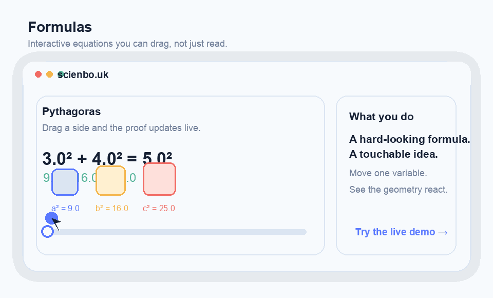

# Sciencebouk — Interactive Math Education Platform

An interactive web application that brings 17 landmark mathematical equations to life through rich visualizations, hands-on exploration, and guided lessons.

## Live Demo

**Try it now:** [sciencebo.uk](https://sciencebo.uk)

The fastest way to understand the project is to open a formula and drag something. Start with Pythagoras, Gravity, or Fourier. No signup is required to explore the core experience.

## Watch It Work



A short loop of the core interaction: move one variable, watch the visualization respond, and understand the idea by touch instead of by lecture.

## Why This Exists

Most people do not actually hate math. They hate being asked to memorize symbols before they are allowed to see what the symbols do. Formulas exists to flip that order: make the idea move first, let curiosity kick in, and only then make the equation feel earned instead of imposed.

## Quick Start

### Development (local)

```bash
# Backend
cd backend
python -m venv .venv && source .venv/bin/activate
pip install -r requirements.txt
python manage.py migrate
python manage.py seed_equations             # the core 17 equations
python manage.py seed_subjects              # extra subjects (CS, chemistry, physics, …)
python manage.py runserver                  # http://localhost:8000

# Frontend (new terminal)
cd frontend
npm install
npm run dev                                 # http://localhost:5173
```

### Docker

The Docker Compose stack (`docker-compose.yml`, the Dockerfiles, and the nginx
config) is part of the project's private deployment infrastructure and is **not
included in this public repository**, so `docker compose up` will not work from a
clean clone. Use the local dev setup above.

## Tech Stack

| Layer | Technology |
|-------|-----------|
| Frontend | React 19, TypeScript 5.8, Vite 6.3, Tailwind CSS 3.4 |
| Visualization | D3 (modular: `d3-scale`, `d3-shape`, `d3-selection`, `d3-drag`, `d3-array`, `d3-transition`), SVG |
| Math rendering | KaTeX 0.16 |
| Data fetching | TanStack React Query 5, React Router 7 |
| Backend | Django 5.2, Django REST Framework 3.16, SQLite (dev) / PostgreSQL (prod via `DATABASE_URL`) |
| Testing | Vitest + React Testing Library (frontend), Django TestCase (backend) |
| CI/CD | GitHub Actions |

## Features

- **17 interactive equation visualizations** — each with sliders, drag handles, and real-time animations
- **Dark mode** — toggleable with system preference detection
- **URL routing** — shareable deep links to each equation (`/equation/3`)
- **Category navigation** — collapsible sidebar groups by subject area
- **Search** — filter equations by title, author, or category
- **Keyboard shortcuts** — arrow keys to navigate, `/` to search, `Esc` to close
- **Mobile responsive** — slide-out drawer on small screens
- **Error boundaries** — graceful degradation if a visualization fails
- **Lazy loading** — scene components code-split for fast initial load

## API Endpoints

All under `/api/`. Auth is JWT (SimpleJWT); endpoints below are public unless
marked **auth** (any signed-in user) or **Pro** (active Pro subscription).

**Equations & content**

| Method | URL | Description |
|--------|-----|-------------|
| GET | `/api/health/` | Health check |
| GET | `/api/equations/` | Paginated list (filterable by `?category=`, `?locale=`) |
| GET | `/api/equations/{id}/` | Single equation detail (by `sort_order`) |
| PATCH | `/api/equations/{id}/progress/` | **Anonymous** progress update (server-issued `user_id`) |
| GET | `/api/search/?q=` | Search equations by title/author/category |
| GET | `/api/courses/{slug}/` | Course with nested lessons (`equation-atlas`, `foundational-algebra` are legacy aliases) |

**Progress & analytics** (auth)

| Method | URL | Description |
|--------|-----|-------------|
| GET | `/api/progress/` | The signed-in user's progress |
| PATCH | `/api/progress/{equation_id}/` | Update the user's progress on one equation |
| POST | `/api/progress/sync/` | Bulk-sync progress from a device |
| GET | `/api/analytics/dashboard/` | Learning dashboard aggregates (**Pro**) |
| POST | `/api/analytics/event/` | Log a learning event (**Pro**) |

**Auth** (`/api/auth/`)

| Method | URL | Description |
|--------|-----|-------------|
| POST | `/api/auth/register/` | Register (invite-gated when enabled) |
| POST | `/api/auth/login/` | Obtain JWT access/refresh tokens |
| POST | `/api/auth/google/` | Google OAuth (ID-token) sign-in |
| POST | `/api/auth/refresh/` | Rotate the access token |
| GET | `/api/auth/me/` | Current user + profile (auth) |
| PATCH | `/api/auth/me/profile/` | Update profile (auth) |
| POST | `/api/auth/me/avatar/` | Upload avatar image (auth) |
| GET / PATCH | `/api/auth/settings/` | Read/update user settings (**Pro**) |

**Payments** (`/api/payments/`)

| Method | URL | Description |
|--------|-----|-------------|
| POST | `/api/payments/checkout/` | Start a Stripe Checkout session (auth) |
| POST | `/api/payments/portal/` | Open the Stripe billing portal (auth, Pro) |
| GET | `/api/payments/status/` | Current tier / Pro status (auth) |
| POST | `/api/payments/webhook/` | Stripe webhook (signature-verified) |

## The 17 Equations

| # | Equation | Category | Visualization |
|---|----------|----------|---------------|
| 1 | Pythagoras's Theorem | Geometry | Draggable proof with area squares |
| 2 | Logarithms | Algebra | Log scale bars + adjustable base curve |
| 3 | Calculus | Calculus | Tangent/secant line with h slider |
| 4 | Law of Gravity | Physics | Draggable masses with force vectors |
| 5 | Wave Equation | Physics | Standing waves with frequency/amplitude |
| 6 | The Square Root of Minus One | Complex Numbers | Argand diagram with multiply-by-i |
| 7 | Euler's Formula for Polyhedra | Topology | 3D rotating polyhedra wireframes |
| 8 | Normal Distribution | Statistics | Bell curve with adjustable mean/std |
| 9 | Fourier Transform | Signal Processing | Waveform decomposition into harmonics |
| 10 | Navier-Stokes Equation | Fluid Dynamics | Particle flow around obstacle |
| 11 | Maxwell's Equations | Electromagnetism | Field lines + EM wave propagation |
| 12 | Second Law of Thermodynamics | Thermodynamics | Entropy particle disorder simulation |
| 13 | Relativity | Physics | Lorentz factor, time dilation clocks |
| 14 | Schrodinger's Equation | Quantum Mechanics | Particle-in-a-box wave functions |
| 15 | Information Theory | Information | Shannon entropy + coin flip explorer |
| 16 | Chaos Theory | Dynamical Systems | Bifurcation diagram + cobweb plot |
| 17 | Black-Scholes Equation | Finance | Option pricing with Greeks overlay |

## Testing

```bash
# Frontend
cd frontend && npm run test

# Backend (all apps — courses, accounts, payments)
cd backend && source .venv/bin/activate && python manage.py test -v 2
```

## Environment Variables

See [`.env.example`](.env.example) for all configuration options.

## Contributing

See [CONTRIBUTING.md](CONTRIBUTING.md) for development setup and guidelines.

## License

Copyright (C) 2026 Albert Nikanorov.

This program is free software: you can redistribute it and/or modify it under
the terms of the **GNU General Public License v3.0 or later** (GPL-3.0-or-later)
as published by the Free Software Foundation. See [LICENSE](LICENSE) for the full
text. It is distributed WITHOUT ANY WARRANTY; see the License for details.
